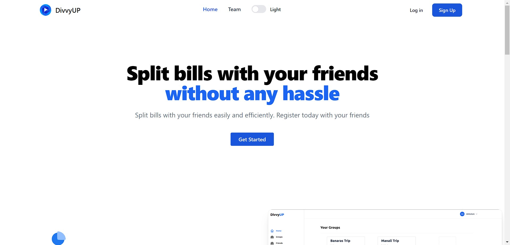
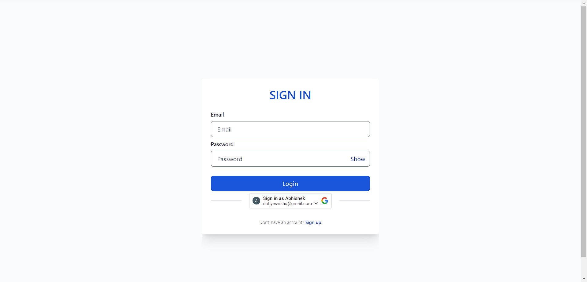
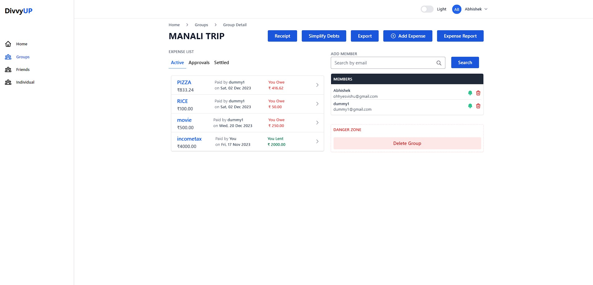
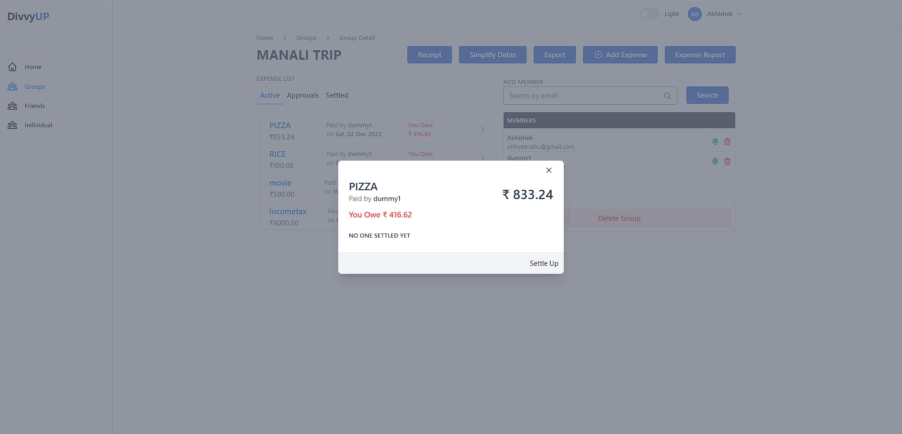
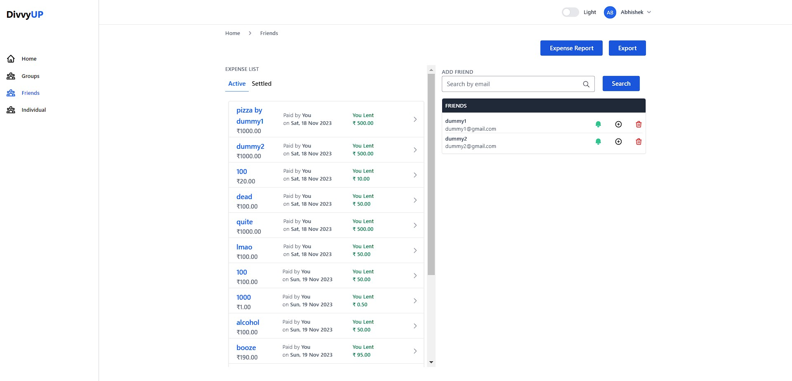

# DivvyUp

## Getting Started
Welcome to a smarter way to manage your finances! In a world where every penny counts, our App is your key to financial empowerment. Our app is designed to simplify and elevate your money management experience.
Managing shared expenses can be a daunting task, leading to confusion, disagreements, and time-consuming calculations. Enter DivvyUP, the ultimate solution to streamline shared finances and alleviate the common challenges associated with communal expenses.

## PPT Link
[Link](https://www.canva.com/design/DAF1tQYKKUQ/Rztt5evaACJZRzpJ66EQ8g/edit?utm_content=DAF1tQYKKUQ&utm_campaign=designshare&utm_medium=link2&utm_source=sharebutton)

## Demo Video Link
[Link](https://youtu.be/AMyt_wwuDxI?si=FLYCIgat2F0YWbOh)

## Tech Stack

1. Node js
2. Express js
3. React js
4. JavaScript
5. MongoDB
6. TailwindCSS
7. Recharts
8. EmailJS
9. ReactOAuth2.0

  ## Contributors:

Team Name: SunnySideUp

* [Abhishek Patel](https://github.com/meisabhishekpatel)
* [Shashwat Mishra](https://github.com/DrDRUNKESTEIN)
* [Vikash Singh](https://github.com/VikashSingh0007)

### Installation instructions
1. Clone folder from github .
2. Run " npm i " for node modules for frontend as well backend.
2. For backend run npm start.
3. For frontend run npm start.

## Features
1. Record daily transactions.
2. Make groups with frineds.
3. Simplify and settle debts in groups.
4. Get the best analysis about savings and expenditure.
5. Save bills and receipts.
6. Track your expenses.
7. Realtime currency exchange.
8. Easy to understand visualization of transactions.
9. Get notified on due payments.
10. Export expenses to spreadsheet.

## Screenshots

  
  

      

  
  

      

  
  

  

  
  

  

  
  

  

  
  

    <!-- 

  
  

    

  
  

  

  
  

  

  
  
 -->
 

